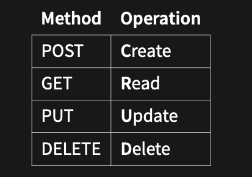
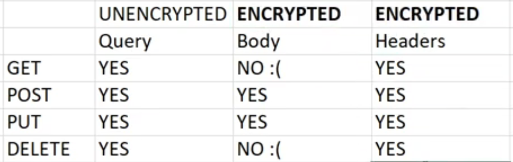
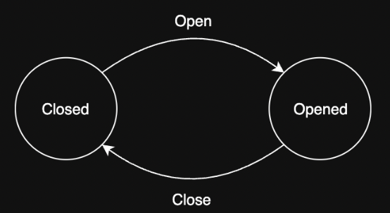
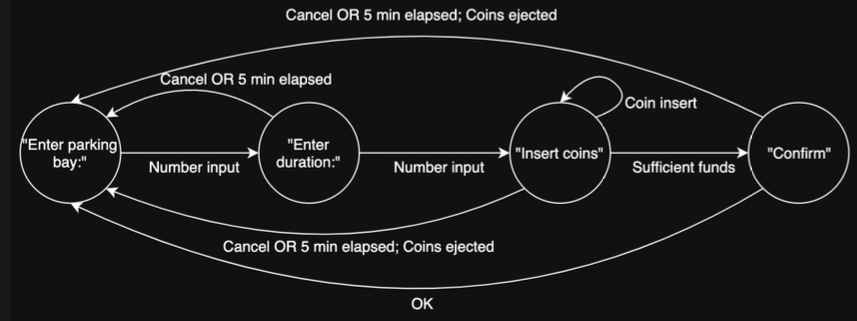

# 1531 - Software Engineering Fundamentals

## General Info

Course Email: cs1531@cse.unsw.edu.au

- Labs - 10%
- Group Project - 60%
- Individual Project - 30%
- Tutorial attendance required
- Labs due on Monday 5pm the following week

_TUTORIAL CODE LINK - https://nw-syd-gitlab.cseunsw.tech/z5363488/comp1531-23t3-h09b_

## Git Commands

```bash
  # clone repo to current directory
  git clone <repo>                 

  # --all flag to stage all changes
  git add                          

  # commit any staged files
  git commit -m        

  # push changes to remote repo            
  git push      

  # pull changes from remote repo                  
  git pull         

  # check any stages, unstaged or untracked files               
  git status

  # check commit log                        
  git log           

  # switch to branch
  git checkout [branch]     

  # create a new branch        
  git checkout -b [branch_name]   

  # initialise new branch in remote repo  
  git push -u origin "branch_name" 

  # merge branch_name to main branch 
  git merge "branch_name"           
```
## Git Undo
```bash
# Sets all code to specific commit hash (removing ALL changes since that commit)
git reset --hard [hash]

# Keeps all of your current code, but changes what commit you're pointing to
git reset --soft [hash]

# Updating previous commit name
git commit --ammend -m "Commit"
```

## Javascript

Javascript is a high level, dynamically typed, interpreted, object-oriented language that is massively used in web development.

#### Node

- NodeJS is a command line interface that `interprets` Javascript code within a runtime environment that is built on Google's V8 engine.
- NodeJS is an `interpreted language` instead of a compiled language, meaning it is compiled and run as part of the same step.

#### Variables, Printing

```js
const name = "Denton"; // Constant value that cannot be changed
let age = 18; // Variable type, can be changed from numbers to strings etc.
console.log(name, age); // Does on a newline
```

#### Strings

Can use either ' ' or " " for strings in js, when you need to mix variables and strings use `` to create a string literal

```js
// Normal String Example
let sentence = "My";
sentence = sentence + " name is";
sentence += " Pikachu";
console.log(sentence);

// String literal Example
const age = 7;
const myname = "Pikachu";
const phrase = `My name is ${myname} and I am ${age}`;
console.log(phrase);
```

#### Other

`if, else if, else, while` are very similar to C.

#### For in and For of loops

- For In statement loops through the properties of an array.
- For Of statement loops through the values of an array.

```js
for (const i in items) {
  console.log(items[i]);
}

for (const item_i of items) {
  console.log(item_i);
}
```

#### Objects

- Objects are variables that contain many name: values pairs.
- `const car = {type:"Fiat", model:"500", color:"white"};`
- Normally declared with `const`

Can access elements in a object by `object.element` or `object['element']`

## npm (node package manager)

```bash
npm init                    # setup a repo to use npm, creates a package.json file
npm install [dependency]    # install a dependency, creates a node_modules directory
```

`package.json` - Stores meta data about the project including a list of dependencies to install (committed to git).

`package-lock.json` - Stores versioning information about dependencies to ensure everyone has the right versions (committed to git).

`node_modules/` - Location of dependencies installed locally (not commited to git).

create a `.gitignore` file and add files that are untracked.

If you are working as a team, when you `git pull`, also run `npm install` to update the `package.json` file.

#### Importing Libraries 

```js
// importing external libraries
import module from "path";

// export locally to another file (can only be used once)
// can rename in the import file 
export default module;
import module from "path";

// named export (for multiple functions)
export { module_one, module_two };
import { module_one, module_two as renamedmod_one } from "path";
```

## Data interchange formats
To enable this standard interface for data, we have data interchange formats:
- `JSON` 
- `YAML`
- `XML`

#### JSON
- No trailing commas
- Object keys must include " "
```json
{
"locations": [ 
  {
    "suburb" : "Kensington",
    "postcode": 2033
  }, 
  { 
    "suburb" : "Mascot",
    "postcode": 2020
  }, 
  { 
    "suburb" : "Sydney CBD",
    "postcode": 2000
  }
 ]
}
```

- `JSON.stringify(data_structure)` to convert code to JSON strings
- `fs.writeFileSync('file.json', data, { flag: 'w' })` to write
- `fs.readFileSync('file.json', { flag: 'r' })` to read
- `JSON.parse(data_structure)` to covert the JSON strings to code

 ## Typescript
TypeScript is a syntactic superset of JavaScript which adds static typing, allowing developers to add types.
```ts
function my_sum(a: number, b: number) {
  return a + b;
}
console.log(my_sum(1, 2));
```

- `npm install --save-dev typescript ts-node` - dependency to use typescript
- `./node_modules/.bin/ts-node file.ts` - compiles the .ts and runs it
- `./node_modules/.bin/tsc --noImplicitAny file.ts.` - only compiles and checks for errors

In typescript run `ts-node` instead of `node`, edit `package.json` file  

```json
"scripts": {
  "ts-node": "ts-node",
  "tsc": "tsc --noImplicitAny"
}
```

#### Basic Types
Basic types in TS are `number, string, boolean`

#### Unions
Are types that can be more than a single type
`variable: number | boolean`

#### Arrays
Represented in TS as `Array<number>` or  `number[]`

#### Aliases
```ts
type Listitem = string | number;

const arr: Listitem[] = [];
```

#### Linting
A linter does static analysis to identify style issues (white-space, indentation) and sematic issues (bad logic, bugs)

## Advanced JS functions
```js
// Defining a function
function sum(a, b) {
  return a + b;
}

const sum = function(a, b) {
  return a + b;
}

const sum = (a, b) => {
  return a + b;
}
```

- A first-class function can be treated like a variable and be passed into other functions

#### Map
Takes array of size N and produces a new array of size N, where all elements of array have been modified according to a function.
```js
newArray = array.map(function);
```

#### Filter
Takes an array of size N, and produces a new array of size 0..N without modifying any of the data.
```js
newArray = array.filter(function);
```

#### Reduce
Executes a reducer function (that you provide) on each member of the array resulting in a single output value.

```js
value = array.reduce(function, 0);
```

#### Anonymous Functions
If function is intended to be used only once, pass it directly into a function (without a name so anonymous function).
```js
const marks = [[65, 72, 81, 40, 56]];
const pass = tutors.map((marks) => marks >= 50);
```

#### Callback function
A callback is a function passed as an argument to another function, allowing functions to call other functions.

#### Higher Order functions
Are functions that take in functions as a parameter or returns a function.

```js
// congratMarkCR is basically the ret func with the markstr already set to pass/credit/distinction.

const genCongratMark = (markstr: string) => {
  const ret = (name: string) => {
    return `Congratulations ${name} on your ${markstr}`;
  };
  return ret;
};
const congratMarkPS = genCongratMark('pass');
const congratMarkCR = genCongratMark('credit');
const congratMarkDN = genCongratMark('distinction');
console.log(congratMarkCR('Hayden'));
```

## HTTP Servers
- `Network`: A group of interconnected computers that can `communicate`
- Internet: A global infrastructure for networking computers around the entire world together
- `World Wide Web`: A subset of the Internet consisting of the pages that can be accessed via URLs. 
- `Protocal`: is a system of rules that define how data is exchanged within or between computers.
 
HTTP (Hypertext Transfer Protocol) is a protocol that defines how data is transmitted over the internet or network, and it is the standard protocol used by web browsers and web servers.

#### Express
Express is a Node.js web application framework that allows you to run your own HTTP server. 

#### API
An API (Application Programming Interface) refers to an interface exposed by a particular piece of software.  
The interface of the service acts as a black box and indicates that for particular endpoints, and given particular input, the client can expect to receive particular output.

#### RESTful API
An API that uses HTTP requests to `GET, PUT, POST and DELETE` data. 



For inputs:
- GET|DELETE: either via
  - `req.query` (capture URL query string) - unencrypted
  - `req.params` (capture URL path variable) - unencrypted
  - `req.headers` (capture headers) - encrypted
- PUT|POST: either via
  - `req.query` (capture URL query string) - unencrypted
  - `req.params` (capture URL path variable)- unencrypted
  - `req.body` (capture request body data) - encrypted
  - `req.headers` (capture headers) - encrypted
- For outputs:
  -  All outputs should be packaged up as JSON



Use `app.use(express.json());` instead of `app.use(express.text());` to avoid `JSON.stringify` and `JSON.parse` functions.

When sending HTTP request, you need to send a `JSON string`

```js
const res = request('POST', `${url}:${port}/v1/admin/auth/logout`, {
      body: { token: 25 },
      headers: { 'Content: type': 'application/json' },
    });
```

```js
   const res = request('POST', `${url}:${port}/v1/admin/auth/logout`, {
      json: {
        token: 25
      },
    });
```

## Persistence
`Data`: facts that can be recorded and have implicit meaning
 - From data(raw) we can find insights (information) that allows us to make decisions.

`Database`: Used to describe a store of data, three ways to store data: 
  - In-memory
  - In-file
  - In-database

`Persistence`:  when program state outlives the process that created it. This is achieved by storing the state as data in computer data storage.

Note: In COMP1531 the extent of persistence is just storing the data in a file. 

## Exceptions
Exceptions is an action that disrupts the normal flow of the program. (Crashes the program)

Instead of `process.exit(1)`, use exceptions:
```js
const errorFunction = () => {
  throw new Error('Error: error message');
}

try { 
  errorFunction();
} catch (err) {
  console.error(`Error: ${err.message}`);
}
```

So when the error is thrown, then `errorFunction` is popped off the stack and it goes into the `catch` statement in the function that called it

#### Testing for Exceptions
```js
test ('Exception Test', () => {
    expect(() => errorFunction()).toThrow('Error: error message');
    expect(() => errroFunction()).toThrowError('Error: error message');
});

// The expect works as below 
function expect(fn) {
  try {
    fn();
  } catch (err) {
    // stuff
  }
}
```
## Conceptual Modelling
A` model` is a simplified representation to assist in understanding something more complex.

A `conceptual model` is a type of model that captures a system in a conceptual way rather
than a physical way.
They tend to be diagramatic or visual.

### State Diagrams
A diagrammatic representation of a state.
- States are circles
- Transitions are labelled arrows connecting them

Simple example: A door



<br>

- State diagrams are used to describe state machines.
- `State machines` are made up of a finite number of states. 
  - Example: UI with different screens



## Authentication
- `Authentication`: Process of verifying the identity of a user (E.g. checking username and password)
- `Authorisation`: Process of determining an authenticated user's access privileges (E.g. checking if admin or not)

`Hashing`
- Hash functions are mathematical functions that transform a given set of data into a bit string of fixed size known as a "hash value" (used in cryptography) - irreversible

`Encryption`
- Encryption is the process of protecting information or data by using mathematical models to scramble it in such a way that only the parties who have the key to unscramble it can access it - reversible.
- To decode the data back to plaintext requires the use of a decryption key, a string of numbers or a password.

`Encryption` and `Hashing` are both processes of taking plaintext information and turning it into a random string of characters.

## Deployment
Activities relating to making a software system available for use

#### Cloud Services
Numerous cloud services offer the ability to "easily" deploy your web applications. Examples include:
- Amazon Web Services 
- Google App Engine 
- Heroku

#### Continuous Delivery
Allows accepted code changes to be deployed to customers quickly and sustainably.
- This involves the automation of the release process such that releases can be done in a "button push".
- Many companies will have a daily or weekly deployment or "ship".
-  To "ship" code there is a "sign off" process (human intervention) to deploy the code.

## Coverage
- `Test Coverage`: a measure of how much of the feature set is covered with tests. This is often left to human judgement
  
- `Code coverage`: a measure of how much code is executed during testing. This can be computed and quantified

- Run `jest --coverage` to run tests with coverage on.
  
- You can access an HTML summary in `coverage/lcov-report/index.html`.

#### Branch Coverage Checking
- A program can jump from one line to another so you must check how many branches were tested during execution.
- Branch coverage is a more accurate measurement so you should use it instead of statement coverage.

## Requirements
A condition or capability needed by a user to solve a problem or achieve an objective

### Functional vs Non-Functional Requirements
- Functional Requirements
  - Statements of services the system should provide, how the system should react to particular inputs and how the system should behave in particular situations.
  - May state what the system should not do.
- Non-functional Requirements
  - Constraints on the services or functions offered by the system such as timing
constraints, constraints on the development process, standards, etc

## Validation
`Verification` - System has been built right  
`Validation` - Right system has been built

## Individual-Project 
`1531 dryrun individualproject`

```js
// To view the dryrun
cat ~cs1531/bin/indivdualproject.test.py

// To copy it into your current folder
cp ~cs1531/bin/indivdualproject.test.py .

// To run it locally
python3 indivdualproject.test.py
```

- A todoItem may have a deadline. Meeting or failing this deadline determines the score. Have a look at the model in `GET/todo/item` for details.
The score is determined when a terminal state is reached, namely the `"DONE"` state.

- Null values should be passed as a `string` for routes that use query parameters `(GET/DELETE)`. 

```js
const queryRequest = request(
  'GET',
  'https://example.com/echo',
  {
    qs: { parameter: 'null' },
  }
);
```
- Literal null for routes that use body parameters (POST/PUT).
```js
const queryRequest = request(
  'POST',
  'https://example.com/echo',
  {
    json: { parameter: null },
  }
);
```


